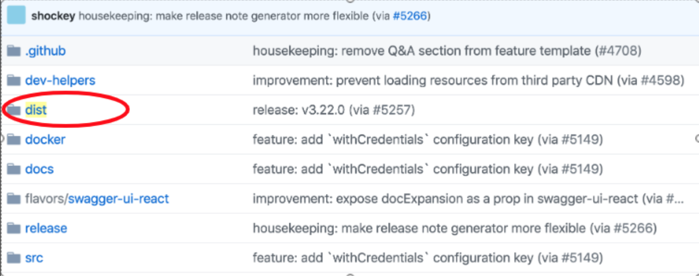
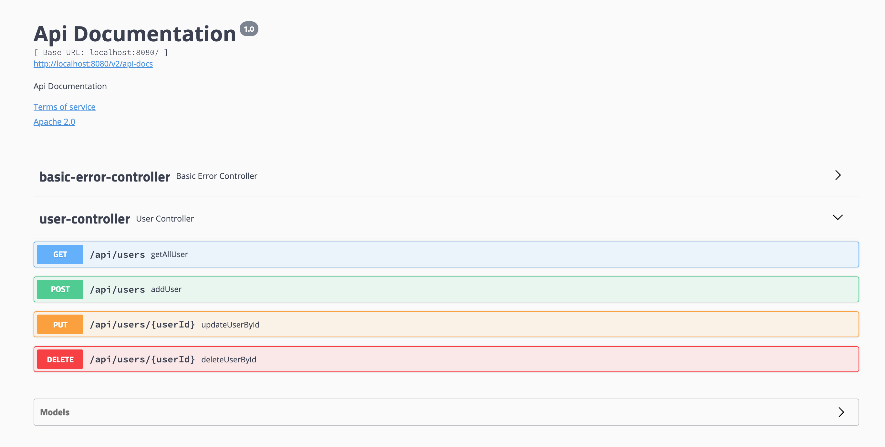

## 使用 Swagger 来构建的Restful API 文档

### 练习描述
- 在`UserController`中按照Swagger配置来补全注解
```
// Todo:此处写注解

@RestController
@RequestMapping("/api")
public class UserController {

    @Autowired
    private UserService userService;

    @GetMapping("/users")
    public ResponseEntity getAllUser() {
        return new ResponseEntity<>(userService.getAllUser(), HttpStatus.OK);
    }
```
- 在`build.gradle`中按照Swagger配置来补全依赖
```
dependencies {
	implementation 'org.springframework.boot:spring-boot-starter-web'
	testImplementation 'org.springframework.boot:spring-boot-starter-test'
	//ToDo:在此处填写依赖
}

```
- 拷贝`https://github.com/swagger-api/swagger-ui`中的`dist`放在`main/webapp/swagger`文件夹内




### 环境描述
- java8
- Intellij-IDEA

### 如何开始
- 克隆模版库
- 启动项目，若出现 Tomcat started on port(s): 8080 (http) 字样，并打开`localhost:8080/api/users`页面后输出如下格式，说明项目启动成功。
```
[
    {
       id: 1,
       name: "小明"
    },
    {
       id: 2,
       name: "小红"
    },
    {
       id: 3,
        name: "小花"
    }
]
```


### 输出规范
-  在`UserController`补全注解。
-  在`build.gradle`补全swagger依赖。
-  访问`http://localhost:8080/swagger-ui.html`如下图


